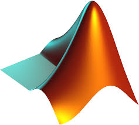
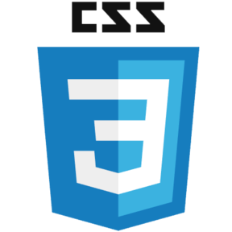

<!-- Page 1 -->
<!-- =====================================  -->
<!-- TODO tableau  -->

Column 
-------------------------------------
    
<!--  -->
    
```{r,results="asis"}
library(rmarkdown)
library(htmltools)
library(flexdashboard)
# cat( paste( readLines( "./HTML/vertical_timeline.html" ), collapse="\n" ))
h3("Mon parcours")
# icon::fa("cog", size = 2, animate = "rotate")

HTML(source("HTML/timeline.R")$value)
```
   
Column {.tabset data-height=10000}
-------------------------------------
   
### Informations   

```{r,out.width = "200px"}
library(icon)
library(knitr)
library(icon)
library(png)
 
HTML(" Développeur, statisticien <br> Ministère de la Transition Écologique et Solidaire ")
HTML("<br>")

```   
```{r}
fa_address_card(size = 2, animate = "rotate")
HTML("Adresse<br>")
fa_phone(size = 2, animate = "rotate")
HTML("Tel<br>")
fa(name = "cog", size = 2, animate = "rotate")
HTML("CV réutilisable<br>")

```   
   
### Code

```{r}
library(highcharter)
library(tibble)
data <- tibble(label = c("R", "Matlab", "Python","HTML/CSS/JS"), data = c(10, 7, 5, 2))

highchart() %>% 
hc_chart(type = "pie") %>% 
hc_add_series_labels_values(labels = data$label, values = data$data, size = 500, style = list(fontSize = "20px")) %>% 
hc_title(text = "Temps passé sur chaque langage de programmation") %>%
  hc_subtitle(text = "Le détail est présenté dans la frise chronologique et dans l'onglet TimeViz")


```   
 

### Timevis
```{r}
library(timevis)

# Template for world cup HTML of each item
templateCode <- function(stage, team1, team2, score1, score2) {
  sprintf(
    '<table><tbody>
      <tr><td colspan="3"><em>%s</em></td></tr>
      <tr>
        <td>%s</td>
        <th>&nbsp;%s - %s&nbsp;</th>
        <td>%s</td>
      </tr>
      <tr>
        <td></td>
        <th></th>
        <td></td>
      </tr>
    </tbody></table>',
    stage, team1, score1, score2, team2, gsub("\\s", "", tolower(team1)),
    team1, gsub("\\s", "", tolower(team2)), team2
  )
}

dataBasic <- data.frame(
  id = 1:6,
  content = c(HTML('Java <br> '),
              HTML('Matlab <br> '), 
              HTML('Python <br> '), 
              HTML('Matlab <br> '), 
              HTML('R <br> '),
              HTML('HTML/CSS/Js <br> 
                   
                   ')
              ),
  start   = c("2016-01-10", "2017-04-01", "2017-09-01", "2018-04-01", "2018-09-01", "2019-01-01"),
  # end    = c("2016-09-01", "2017-10-01", "2018-09-01", "2018-09-01", Sys.Date(), Sys.Date())
  end = c("2016-09-01", "2017-10-01", "2018-09-01", "2018-09-01", "2020-04-01", "2020-04-01")
)
 config <- list(
      editable = F,
      align = "center",
      orientation = "top",
      snap = NULL,
      margin = list(item = 30, axis = 50)
    )

timevis(dataBasic, zoomFactor = 1, options = config)

    
    

```

### Langues
    
```{r}
library(formattable)

langues <- tibble(
  Langue = c("Francais","Anglais","Arabe","Japonais","Chinois"),
  Niveau = c("Professionnel","Professionnel","Langue natale","Débutant","Débutant"),
  Note = c(10, 9, 4, 1, 1)
)

formattable(langues, list(
  area(col = Note) ~ normalize_bar("pink", 0.2)
))

```

### Premier poste
    
```{r}
```

<!-- Page 2 -->
<!-- =====================================  -->